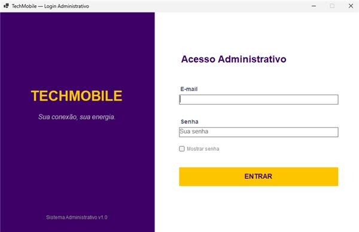
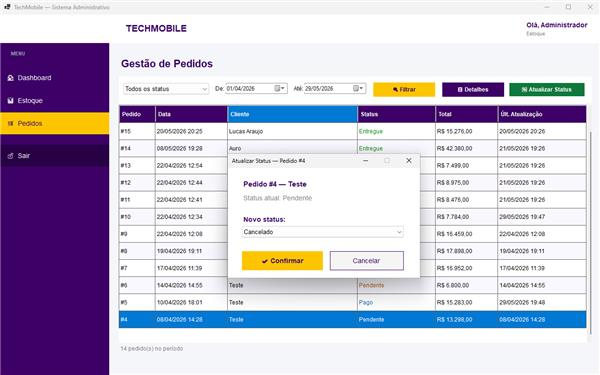

# 📱 TechMobile - Ecossistema Integrado (Web + Desktop)

Este repositório contém a solução completa e integrada do projeto **TechMobile** (identidade de marca *Nexus Celulares*), um ecossistema corporativo de e-commerce e retaguarda administrativa de ponta a ponta. 

O projeto é composto por duas aplicações independentes que se comunicam e compartilham a mesma base de dados relacional em tempo real.

---

## 🎓 Sobre o Projeto

Este ecossistema foi desenvolvido como entrega mestre para o **Projeto Integrador** do curso de Desenvolvimento de Sistemas / Informática do **SENAC Itaquera**.

O objetivo principal foi consolidar competências avançadas em:
* **Arquitetura de Software:** Implementação rigorosa do padrão **MVC (Model-View-Controller)** em ambas as frentes.
* **Integração de Sistemas:** Comunicação multiplataforma (Web PHP + Desktop C#) consumindo um banco de dados centralizado.
* **Integridade e Segurança de Dados:** Controle transacional de estoque, proteção contra brechas de segurança (SQL Injection) e hashing seguro de credenciais corporativas.

---

## 🏗️ Arquitetura Geral do Sistema

Ambas as aplicações foram reestruturadas sob o padrão **MVC**, separando estritamente a interface do usuário (Views), as regras de negócio e consultas de persistência (Models) e a lógica de orquestração (Controllers).

* 🌐 **Módulo Web (PHP 8 + Bootstrap 5)** ──► Camada View / Cliente
  * *Persistência via PDO* ──► 🗄️ **Banco de Dados Central (MySQL)**
* 💻 **Módulo Desktop (C# .NET 8)** ──► Backoffice / Admin
  * *Conexão MySqlConnector* ──► 🗄️ **Banco de Dados Central (MySQL)**

---

## 🌐 Módulo Web: E-Commerce (Cliente)

A aplicação pública é uma loja virtual responsiva de alta energia voltada para a experiência do consumidor (UX/UI), focada em conversão e usabilidade.

### ⚙️ Funcionalidades Web:
* **Vitrine Dinâmica:** Carregamento em tempo real de produtos categorizados (Destaques, Ofertas e Lançamentos) vindos diretamente do banco de dados.
* **Carrinho de Compras Efêmero:** Gerenciamento reativo de itens em sessão PHP (adicionar, remover, alterar quantidade e cálculo automático de frete/subtotais).
* **Checkout Seguro:** Fluxo estruturado de finalização de pedidos condicionado à autenticação prévia do cliente.

### 🛠️ Tecnologias e Camadas Web:
* **View:** HTML5, CSS3, Bootstrap 5 e Google Fonts para uma estética Cyber Tech.
* **Model & Persistência:** PHP Data Objects (PDO) utilizando *Prepared Statements* contra vulnerabilidades e gerenciamento de transações atômicas no checkout (`beginTransaction` e `commit`).

> **Acesse no seu navegador local:** `http://localhost/seu-diretorio/techmobile/public/index.php`

---

## 💻 Módulo Desktop: Backoffice Administrativo

A aplicação interna é um sistema C# Windows Forms focado na gestão corporativa, controle de estoque, atualização de status de pedidos e moderação de clientes com níveis de acesso estruturados.

---

## 🎥 Demonstração Visual

### Loja Virtual (Web)

### Sistema de Gestão (C# Desktop)
<table>
  <tr>
    <td valign="top" width="50%">
      
<strong>Tela Inicial (C# Desktop)</strong>

      
    </td>
    <td valign="top" width="50%">
      
<strong>Gestão de Pedidos (C# Desktop)</strong>

      
    </td>
  </tr>
</table>

---

## ✍️ Desenvolvido por
**Thaís Vieira** - Turma TI99 (SENAC Itaquera)
